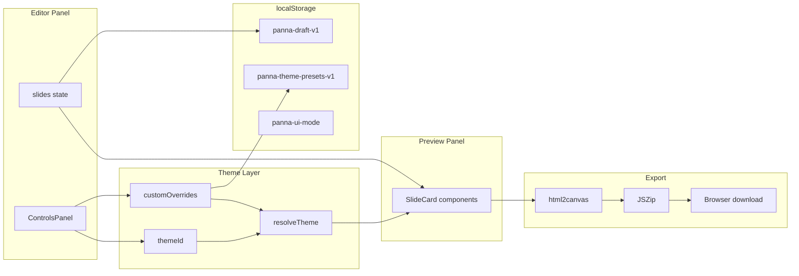
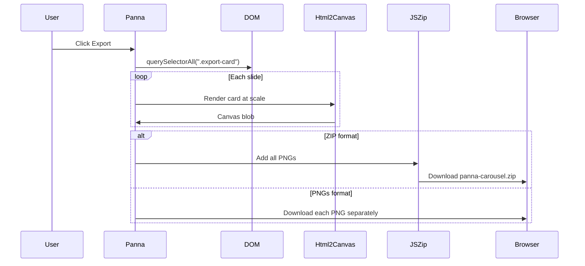

# Panna — Resume Learning Guide

This document explains how **Panna** (a browser-based carousel maker) is built, why each technology was chosen, and how the important pieces of code work together. It is written for someone learning the project from scratch — no prior exposure required.

---

## 1. What is Panna?

**Panna** is a single-page web app (SPA) that helps small business owners create Instagram/LinkedIn carousel slides without design software.

**User flow:**
1. Type slide content in a thread-style editor (left panel on desktop, bottom on mobile).
2. See live preview cards update instantly (right panel on desktop, top on mobile).
3. Customize theme, colors, font, logo, and aspect ratio.
4. Export all slides as high-resolution PNGs (ZIP or individual files).

Everything runs **in the browser** — no server stores your carousel content.

---

## 2. Architecture Overview



**Key idea:** React state is the single source of truth. The preview is not a separate copy — it reads the same state and re-renders on every change.

---

## 3. Tech Stack

| Technology | Role | Why it was used |
|------------|------|-----------------|
| **React 19** | UI framework | Component-based UI, reactive state, large ecosystem |
| **Vite 6** | Build tool / dev server | Fast hot reload, simple config, modern ES modules |
| **JavaScript (ES modules)** | Language | No TypeScript overhead for a focused MVP; `.jsx` for React components |
| **html2canvas** (CDN) | Screenshot DOM → PNG | Turns live preview HTML into exportable images at full resolution |
| **JSZip** | ZIP file creation | Bundles multiple PNGs into one download |
| **Google Fonts CDN** | Typography | Loads Inter, Playfair, etc. on demand |
| **localStorage** | Client persistence | Saves UI mode, drafts, and theme presets without a backend |
| **Playwright** (dev only) | Smoke tests | Automated browser checks; not required for app runtime |

**Deployment:** Static files (`npm run build` → `dist/`) hosted on Vercel/Netlify/GitHub Pages. No Node server needed in production.

---

## 4. Folder Structure

```
Panna/
├── index.html              # Entry HTML, loads html2canvas CDN
├── vite.config.js          # Vite + React plugin config
├── package.json            # Dependencies and scripts
├── src/
│   ├── main.jsx            # React mount point
│   ├── App.jsx             # Renders <Panna />
│   ├── Panna.jsx           # Main app: state, layout, export
│   ├── components/
│   │   ├── SlideCard.jsx   # One carousel slide preview card
│   │   ├── ControlsPanel.jsx # Theme, font, colors, presets UI
│   │   └── AboutModal.jsx  # About dialog
│   ├── constants/
│   │   ├── themes.js       # 9 built-in color themes
│   │   ├── fonts.js        # Font list + Google Fonts URLs
│   │   ├── aspectRatios.js # 1:1, 4:5, 9:16 dimensions
│   │   └── uiTokens.js     # App shell colors (dark/light mode)
│   └── utils/
│       ├── resolveTheme.js # Merge base theme + custom overrides
│       ├── exportSlides.js # html2canvas + ZIP/PNG download
│       ├── insertBullet.js # Insert "• " at cursor in textarea
│       ├── draftStorage.js # Autosave carousel to localStorage
│       └── themePresets.js # Save/load custom theme presets
└── scripts/
    └── smoke-test.mjs      # Playwright end-to-end smoke test
```

---

## 5. Application Bootstrap

### `index.html`
- Sets `<meta name="viewport">` for mobile browsers.
- Loads **html2canvas** from CDN (used at export time, not during normal editing).
- Mounts React via `<script type="module" src="/src/main.jsx">`.

### `main.jsx`
```javascript
createRoot(document.getElementById("root")).render(
  <StrictMode><App /></StrictMode>
);
```
- **createRoot** — React 18+ API to attach the app to the DOM.
- **StrictMode** — Development helper that double-invokes effects to catch bugs.

### `App.jsx`
Thin wrapper that renders `<Panna />` — keeps entry point minimal.

---

## 6. Core State in `Panna.jsx`

`Panna.jsx` is the brain of the app. It holds all carousel state:

| State variable | Purpose |
|----------------|---------|
| `slides` | Array of `{ id, text, index }` — one object per slide |
| `activeSlide` | Which slide is selected (highlights editor + preview) |
| `themeId` | Built-in theme preset id (e.g. `"midnight"`) |
| `customOverrides` | User color overrides: `{ bg, cardBg, accent, text }` |
| `ratio` | Aspect ratio: `"1:1"`, `"4:5"`, or `"9:16"` |
| `fontId` | Selected font from `fonts.js` |
| `logo` | Base64 data URL of uploaded logo image |
| `exportFormat` | `"zip"` or `"pngs"` |
| `uiMode` | App shell: `"dark"` or `"light"` |
| `presets` | Saved custom theme presets from localStorage |
| `activePresetId` | Which user preset is currently applied |

**Derived values (not stored separately):**
- `resolvedTheme = resolveTheme(baseTheme, customOverrides)` — final colors for slides.
- `font = getFontById(fontId)` — font family string for CSS.

---

## 7. Theme System

### Built-in themes (`constants/themes.js`)
Each theme defines: `bg`, `text`, `accent`, `cardBg` — the four colors every slide uses.

### Custom overrides (`utils/resolveTheme.js`)
```javascript
export function resolveTheme(baseTheme, overrides = {}) {
  return {
    ...baseTheme,
    bg: overrides.bg ?? baseTheme.bg,
    cardBg: overrides.cardBg ?? baseTheme.cardBg,
    accent: overrides.accent ?? baseTheme.accent,
    text: overrides.text ?? baseTheme.text,
  };
}
```
- **`??` (nullish coalescing)** — Use override only if it is not `null`/`undefined`; otherwise fall back to theme default.
- **`...baseTheme` (spread)** — Copy all base theme fields, then overwrite specific keys.

### UI tokens (`constants/uiTokens.js`)
Separate from slide themes — controls the **app chrome** (panels, borders, input colors). Dark and light mode each have a token object. Stored preference key: `panna-ui-mode`.

---

## 8. Slide Preview — `SlideCard.jsx`

Each preview card:
1. Splits slide text by newlines into bullet lines.
2. Computes **font size** automatically based on line count and length (`computeFontSize`).
3. Renders with `theme.bg`, `theme.text`, `theme.accent`, optional logo.

**Preview dimensions:** Fixed width `PREVIEW_BASE = 320px`; height scales by aspect ratio (e.g. 4:5 → taller card).

Export uses a **scale factor** = `targetWidth / PREVIEW_BASE` (e.g. 1080/320 = 3.375×) so PNGs export at full social-media resolution.

---

## 9. Export Pipeline — `exportSlides.js`



**Important concepts:**
- **Blob** — Binary large object; in-memory file data in the browser.
- **URL.createObjectURL(blob)** — Temporary URL pointing to blob data for download links.
- **html2canvas** — Reads computed CSS from DOM and paints to a `<canvas>`, then `canvas.toBlob()` produces PNG bytes.

---

## 10. Editor Interactions

| Action | How it works |
|--------|--------------|
| Add slide | `addSlide(index)` splices new slide after current; focuses new textarea |
| Remove slide | Backspace on empty textarea, or × button |
| ⌘/Ctrl+Enter | `handleKeyDown` calls `addSlide` |
| Insert bullet | `insertBullet.js` inserts `"• "` at cursor position |
| Go to slide | `goToSlide(i)` sets active slide + `scrollIntoView` on preview card |
| Export | `handleExport` → `exportSlides({ previewRef, ... })` |

**Refs (`useRef`):**
- `textareaRefs` — Map slide id → textarea DOM node (for focus/cursor).
- `previewRef` — Container holding all `.export-card` elements for export.
- `slidePreviewRefs` — Per-slide wrappers for scroll-into-view.

---

## 11. v3 Features (Mobile, Autosave, Presets)

### Mobile layout (CSS media query)
At `max-width: 768px`:
- Root uses `flex-direction: column-reverse` — preview (2nd in DOM) appears **on top**, editor **on bottom**.
- Each panel gets `50vh` max height with `min-height: 0` so inner scroll works.
- `100dvh` handles mobile browser address bar correctly.

### Draft autosave (`utils/draftStorage.js`)
- **Key:** `panna-draft-v1`
- Saves: slides, theme, colors, font, ratio, logo, export format, active preset.
- **Debounced 500ms** — waits for typing to pause before writing to localStorage.
- **Quota fallback** — if logo makes payload too large, retries save without logo.
- On app load, `useState(() => loadDraft()?.slides ?? ...)` hydrates from saved draft.

### Custom theme presets (`utils/themePresets.js`)
- **Key:** `panna-theme-presets-v1`
- User saves current look under a name (theme + overrides + font).
- Max 10 presets; oldest removed when limit exceeded.
- Applying a preset updates `themeId`, `customOverrides`, `fontId`.
- Editing colors or picking a built-in theme clears `activePresetId`.

---

## 12. React Hooks Used (Glossary)

| Hook | Purpose in Panna |
|------|------------------|
| **useState** | Store slides, theme, UI mode, etc.; triggers re-render on change |
| **useEffect** | Save UI mode to localStorage; load Google Fonts; debounced draft save; re-index slides |
| **useMemo** | Cache `resolvedTheme` — only recompute when theme/overrides change |
| **useCallback** | Stable function references for `addSlide`, `goToSlide`, `handleKeyDown` |
| **useRef** | DOM refs and `skipDraftSave` flag (skip save on first render) |

**Re-render:** When state changes, React re-runs the component function and updates the DOM diff efficiently (Virtual DOM).

---

## 13. Keywords Glossary

| Term | Meaning |
|------|---------|
| **SPA (Single Page Application)** | One HTML page; navigation and updates happen via JavaScript without full page reloads |
| **Component** | Reusable UI unit (function returning JSX) |
| **JSX** | HTML-like syntax inside JavaScript, compiled by Vite |
| **State** | Data that changes over time and drives what the UI shows |
| **Props** | Data passed from parent component to child (read-only in child) |
| **Flexbox** | CSS layout: `display: flex` for row/column alignment |
| **Media query** | CSS rule that applies only at certain screen widths (`@media (max-width: 768px)`) |
| **localStorage** | Browser key-value store (~5MB per origin); persists after tab close |
| **Debouncing** | Delay an action (save) until user stops triggering it (typing) |
| **Base64** | Text encoding of binary data; used for logo images in state/storage |
| **Aspect ratio** | Width:height proportion (1:1 square, 4:5 portrait, 9:16 stories) |
| **CDN** | Content Delivery Network — serves libraries (html2canvas, fonts) from edge servers |
| **ES modules** | `import`/`export` syntax; Vite bundles these for the browser |
| **Hot Module Replacement (HMR)** | Vite updates changed modules in browser without full reload |

---

## 14. Scripts

| Command | What it does |
|---------|--------------|
| `npm run dev` | Start Vite dev server with hot reload |
| `npm run build` | Production bundle to `dist/` |
| `npm run preview` | Serve production build locally |
| `npm run smoke` | Run Playwright smoke test (needs preview server) |

---

## 15. Interview Talking Points

1. **"I built a client-side carousel tool with live preview."**  
   State flows from editor → `resolveTheme` → `SlideCard`; no duplicate data model.

2. **"Export uses html2canvas at scaled resolution."**  
   Preview renders at 320px width; export scale = 1080/320 for Instagram-ready PNGs.

3. **"I added responsive mobile layout with CSS flexbox."**  
   `column-reverse` + 50vh split; no JavaScript breakpoint detection needed.

4. **"Draft autosave uses debounced localStorage with quota handling."**  
   Shows awareness of browser limits and UX (restore on refresh).

5. **"Theme presets are a separate persistence layer from drafts."**  
   Reusable brand themes vs. one-off carousel content — clean data separation.

---

## 16. What Panna Deliberately Does Not Include

- **No backend** — privacy-friendly; nothing leaves the browser except CDN font requests.
- **No user accounts** — simplifies architecture; localStorage only.
- **No markdown** — plain text + newlines for bullet lines keeps rendering predictable.

These are product choices documented in `PRD.md` — good to mention when discussing scope and tradeoffs.

---

## 17. Suggested Next Steps for Learning

1. Run `npm run dev`, edit a slide, watch preview update — trace the data flow in DevTools React extension.
2. Change a theme color — follow `customOverrides` → `resolveTheme` → `SlideCard` style.
3. Resize browser below 768px — inspect flex layout in DevTools.
4. Export a carousel — set breakpoint in `exportSlides.js` and log `scale`.
5. Read `localStorage` in DevTools → Application tab → see `panna-draft-v1` after typing.

---

*Last updated for Panna v3 (mobile layout, draft autosave, theme presets) on branch `feature/mobile-split-layout`.*
