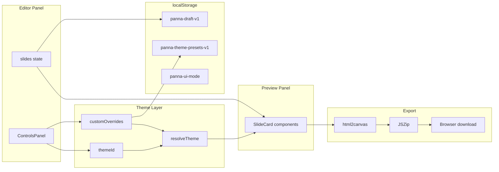
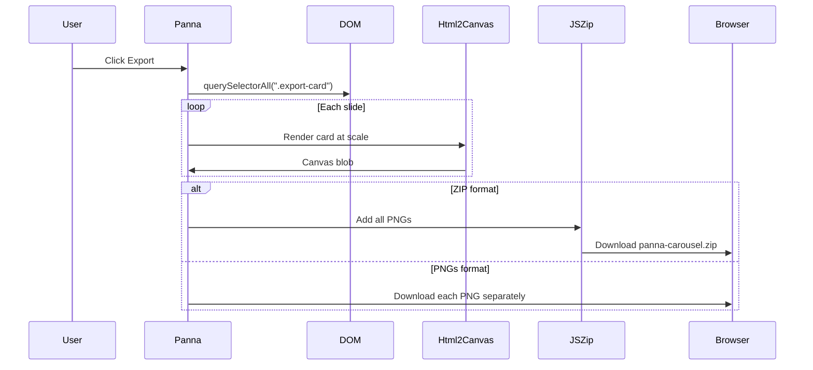
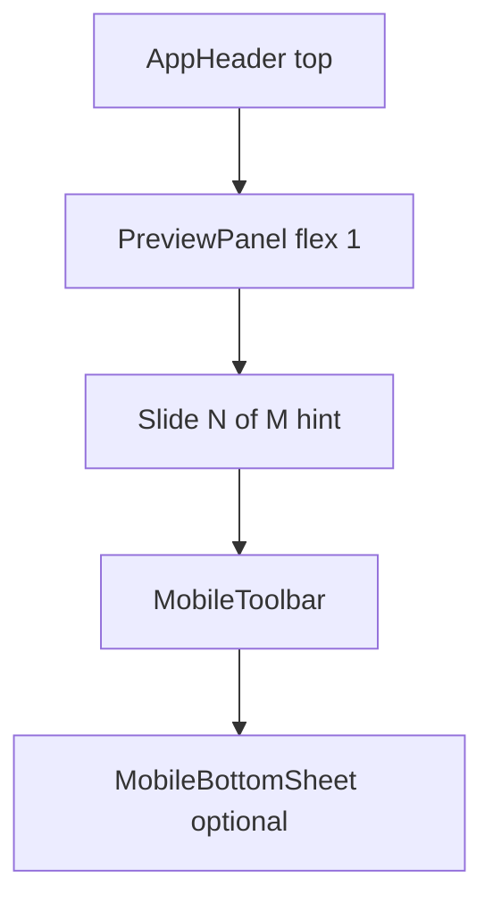

# Panna — Resume Learning Guide

This document explains how **Panna** (a browser-based carousel maker) is built, why each technology was chosen, and how the important pieces of code work together. It is written for someone learning the project from scratch — no prior exposure required.

---

## 1. What is Panna?

**Panna** is a single-page web app (SPA) that helps small business owners create Instagram/LinkedIn carousel slides without design software.

**User flow:**
1. Type slide content in a thread-style editor (left panel on desktop; bottom sheet on mobile).
2. See live preview cards update instantly (right panel on desktop; main screen on mobile).
3. Customize theme, colors, font, logo, and aspect ratio (controls panel on desktop; Settings sheet on mobile).
4. Export all slides as high-resolution PNGs (ZIP or individual files).

Everything runs **in the browser** — no server stores your carousel content.

---

## 2. Architecture Overview



**Key idea:** React state is the single source of truth. The preview is not a separate copy — it reads the same state and re-renders on every change.

---

## 3. Tech Stack

| Technology | Role | Why it was used |
|------------|------|-----------------|
| **React 19** | UI framework | Component-based UI, reactive state, large ecosystem |
| **Vite 6** | Build tool / dev server | Fast hot reload, simple config, modern ES modules |
| **JavaScript (ES modules)** | Language | No TypeScript overhead for a focused MVP; `.jsx` for React components |
| **html2canvas** (CDN) | Screenshot DOM → PNG | Turns live preview HTML into exportable images at full resolution |
| **JSZip** | ZIP file creation | Bundles multiple PNGs into one download |
| **Google Fonts CDN** | Typography | Loads Inter, Playfair, etc. on demand |
| **localStorage** | Client persistence | Saves UI mode, drafts, and theme presets without a backend |
| **vite-plugin-pwa** | Installable web app | Web App Manifest + service worker for Add to Home Screen |
| **Playwright** (dev only) | Smoke tests | Automated browser checks; not required for app runtime |

**Deployment:** Static files (`npm run build` → `dist/`) hosted on Vercel/Netlify/GitHub Pages. No Node server needed in production.

---

## 4. Folder Structure

```
Panna/
├── index.html              # Entry HTML, PWA meta tags, html2canvas CDN
├── vite.config.js          # Vite + React + vite-plugin-pwa
├── public/
│   └── icons/              # PWA icons (icon.svg, icon-192.png, icon-512.png)
├── package.json
├── src/
│   ├── main.jsx            # React mount point
│   ├── App.jsx             # Renders <Panna />
│   ├── Panna.jsx           # State owner; picks Desktop vs Mobile layout
│   ├── hooks/
│   │   └── useMediaQuery.js # Detect viewport <= 768px
│   ├── components/
│   │   ├── AppHeader.jsx   # Logo, Export, About, dark mode toggle
│   │   ├── SlideThread.jsx # Slide textareas + add/remove
│   │   ├── PreviewPanel.jsx # Preview strip + dot navigation
│   │   ├── MobileToolbar.jsx # Settings / Slides toggle buttons
│   │   ├── MobileBottomSheet.jsx # Collapsible panel wrapper
│   │   ├── layout/
│   │   │   ├── DesktopLayout.jsx  # Side-by-side editor + preview
│   │   │   ├── MobileLayout.jsx   # Header + preview + sheets
│   │   │   └── layoutStyles.js    # Shared CSS including mobile rules
│   │   ├── SlideCard.jsx
│   │   ├── ControlsPanel.jsx
│   │   └── AboutModal.jsx
│   ├── constants/          # themes, fonts, aspectRatios, uiTokens
│   └── utils/              # resolveTheme, exportSlides, draftStorage, etc.
└── scripts/smoke-test.mjs
```

---

## 5. Application Bootstrap

### `index.html`
- Sets `<meta name="viewport">` for mobile browsers.
- PWA meta tags: `theme-color`, `apple-mobile-web-app-capable`, apple touch icon.
- Loads **html2canvas** from CDN (used at export time, not during normal editing).
- Mounts React via `<script type="module" src="/src/main.jsx">`.

### `main.jsx`
```javascript
createRoot(document.getElementById("root")).render(
  <StrictMode><App /></StrictMode>
);
```
- **createRoot** — React 18+ API to attach the app to the DOM.
- **StrictMode** — Development helper that double-invokes effects to catch bugs.

### `App.jsx`
Thin wrapper that renders `<Panna />` — keeps entry point minimal.

---

## 6. Core State in `Panna.jsx`

`Panna.jsx` is the **state owner** (~350 lines). It holds all carousel state and passes props to layout components:

| State variable | Purpose |
|----------------|---------|
| `slides` | Array of `{ id, text, index }` — one object per slide |
| `activeSlide` | Which slide is selected (highlights editor + preview) |
| `themeId` | Built-in theme preset id (e.g. `"midnight"`) |
| `customOverrides` | User color overrides: `{ bg, cardBg, accent, text }` |
| `ratio` | Aspect ratio: `"1:1"`, `"4:5"`, or `"9:16"` |
| `fontId` | Selected font from `fonts.js` |
| `logo` | Base64 data URL of uploaded logo image |
| `exportFormat` | `"zip"` or `"pngs"` |
| `uiMode` | App shell: `"dark"` or `"light"` |
| `presets` | Saved custom theme presets from localStorage |
| `activePresetId` | Which user preset is currently applied |
| `mobileSheet` | Mobile only: `null`, `"settings"`, or `"slides"` |

**Layout switch:**
```javascript
const isMobile = useMediaQuery("(max-width: 768px)");
return isMobile ? <MobileLayout {...props} /> : <DesktopLayout {...props} />;
```

**Derived values (not stored separately):**
- `resolvedTheme = resolveTheme(baseTheme, customOverrides)` — final colors for slides.
- `font = getFontById(fontId)` — font family string for CSS.

---

## 7. Theme System

### Built-in themes (`constants/themes.js`)
Each theme defines: `bg`, `text`, `accent`, `cardBg` — the four colors every slide uses.

### Custom overrides (`utils/resolveTheme.js`)
```javascript
export function resolveTheme(baseTheme, overrides = {}) {
  return {
    ...baseTheme,
    bg: overrides.bg ?? baseTheme.bg,
    cardBg: overrides.cardBg ?? baseTheme.cardBg,
    accent: overrides.accent ?? baseTheme.accent,
    text: overrides.text ?? baseTheme.text,
  };
}
```
- **`??` (nullish coalescing)** — Use override only if it is not `null`/`undefined`; otherwise fall back to theme default.
- **`...baseTheme` (spread)** — Copy all base theme fields, then overwrite specific keys.

### UI tokens (`constants/uiTokens.js`)
Separate from slide themes — controls the **app chrome** (panels, borders, input colors). Dark and light mode each have a token object. Stored preference key: `panna-ui-mode`.

---

## 8. Slide Preview — `SlideCard.jsx`

Each preview card:
1. Splits slide text by newlines into bullet lines.
2. Computes **font size** automatically based on line count and length (`computeFontSize`).
3. Renders with `theme.bg`, `theme.text`, `theme.accent`, optional logo.

**Preview dimensions:** Fixed width `PREVIEW_BASE = 320px`; height scales by aspect ratio (e.g. 4:5 → taller card).

Export uses a **scale factor** = `targetWidth / PREVIEW_BASE` (e.g. 1080/320 = 3.375×) so PNGs export at full social-media resolution.

---

## 9. Export Pipeline — `exportSlides.js`



**Important concepts:**
- **Blob** — Binary large object; in-memory file data in the browser.
- **URL.createObjectURL(blob)** — Temporary URL pointing to blob data for download links.
- **html2canvas** — Reads computed CSS from DOM and paints to a `<canvas>`, then `canvas.toBlob()` produces PNG bytes.

---

## 10. Editor Interactions

| Action | How it works |
|--------|--------------|
| Add slide | `addSlide(index)` splices new slide after current; focuses new textarea |
| Remove slide | Backspace on empty textarea, or × button |
| ⌘/Ctrl+Enter | `handleKeyDown` calls `addSlide` |
| Insert bullet | `insertBullet.js` inserts `"• "` at cursor position |
| Go to slide | `goToSlide(i)` sets active slide + `scrollIntoView` on preview card |
| Export | `handleExport` → `exportSlides({ previewRef, ... })` |

**Refs (`useRef`):**
- `textareaRefs` — Map slide id → textarea DOM node (for focus/cursor).
- `previewRef` — Container holding all `.export-card` elements for export.
- `slidePreviewRefs` — Per-slide wrappers for scroll-into-view.

---

## 11. v3 Features (superseded mobile layout)

The first mobile attempt used `column-reverse` + 50/50 split. **Problem:** the bottom half had to fit header + ControlsPanel + textareas, leaving almost no room to type. Header also appeared mid-screen. v4 (below) replaces this.

### Draft autosave (`utils/draftStorage.js`)
- **Key:** `panna-draft-v1`
- Saves: slides, theme, colors, font, ratio, logo, export format, active preset.
- **Debounced 500ms** — waits for typing to pause before writing to localStorage.
- **Quota fallback** — if logo makes payload too large, retries save without logo.
- On app load, `useState(() => loadDraft()?.slides ?? ...)` hydrates from saved draft.

### Custom theme presets (`utils/themePresets.js`)
- **Key:** `panna-theme-presets-v1`
- User saves current look under a name (theme + overrides + font).
- Max 10 presets; oldest removed when limit exceeded.
- Applying a preset updates `themeId`, `customOverrides`, `fontId`.
- Editing colors or picking a built-in theme clears `activePresetId`.

---

## 12. React Hooks Used (Glossary)

| Hook | Purpose in Panna |
|------|------------------|
| **useState** | Store slides, theme, UI mode, etc.; triggers re-render on change |
| **useEffect** | Save UI mode to localStorage; load Google Fonts; debounced draft save; re-index slides |
| **useMemo** | Cache `resolvedTheme` — only recompute when theme/overrides change |
| **useCallback** | Stable function references for `addSlide`, `goToSlide`, `handleKeyDown` |
| **useRef** | DOM refs and `skipDraftSave` flag (skip save on first render) |

**Re-render:** When state changes, React re-runs the component function and updates the DOM diff efficiently (Virtual DOM).

---

## 13. Keywords Glossary

| Term | Meaning |
|------|---------|
| **SPA (Single Page Application)** | One HTML page; navigation and updates happen via JavaScript without full page reloads |
| **Component** | Reusable UI unit (function returning JSX) |
| **JSX** | HTML-like syntax inside JavaScript, compiled by Vite |
| **State** | Data that changes over time and drives what the UI shows |
| **Props** | Data passed from parent component to child (read-only in child) |
| **Flexbox** | CSS layout: `display: flex` for row/column alignment |
| **Media query** | CSS rule that applies only at certain screen widths (`@media (max-width: 768px)`) |
| **localStorage** | Browser key-value store (~5MB per origin); persists after tab close |
| **Debouncing** | Delay an action (save) until user stops triggering it (typing) |
| **Base64** | Text encoding of binary data; used for logo images in state/storage |
| **Aspect ratio** | Width:height proportion (1:1 square, 4:5 portrait, 9:16 stories) |
| **CDN** | Content Delivery Network — serves libraries (html2canvas, fonts) from edge servers |
| **ES modules** | `import`/`export` syntax; Vite bundles these for the browser |
| **Hot Module Replacement (HMR)** | Vite updates changed modules in browser without full reload |

---

## 14. Scripts

| Command | What it does |
|---------|--------------|
| `npm run dev` | Start Vite dev server with hot reload |
| `npm run build` | Production bundle to `dist/` |
| `npm run preview` | Serve production build locally |
| `npm run smoke` | Run Playwright smoke test (needs preview server) |

---

## 15. Interview Talking Points

1. **"I built a client-side carousel tool with live preview."**  
   State flows from editor → `resolveTheme` → `SlideCard`; no duplicate data model.

2. **"Export uses html2canvas at scaled resolution."**  
   Preview renders at 320px width; export scale = 1080/320 for Instagram-ready PNGs.

3. **"I redesigned mobile with preview-first layout and bottom sheets."**  
   Settings and slide editor are hidden by default; user opens them via toolbar. Header stays at top of app.

4. **"Draft autosave uses debounced localStorage with quota handling."**  
   Shows awareness of browser limits and UX (restore on refresh).

5. **"Theme presets are a separate persistence layer from drafts."**  
   Reusable brand themes vs. one-off carousel content — clean data separation.

6. **"Refactored into layout components while keeping one state owner."**  
   `Panna.jsx` owns state; `DesktopLayout` / `MobileLayout` only arrange UI.

7. **"Added PWA support for Add to Home Screen."**  
   `vite-plugin-pwa` generates manifest + service worker; app opens standalone like a native shell.

---

## 16. What Panna Deliberately Does Not Include

- **No backend** — privacy-friendly; nothing leaves the browser except CDN font requests.
- **No user accounts** — simplifies architecture; localStorage only.
- **No markdown** — plain text + newlines for bullet lines keeps rendering predictable.

These are product choices documented in `PRD.md` — good to mention when discussing scope and tradeoffs.

---

## 17. Suggested Next Steps for Learning

1. Run `npm run dev`, edit a slide, watch preview update — trace the data flow in DevTools React extension.
2. Change a theme color — follow `customOverrides` → `resolveTheme` → `SlideCard` style.
3. Resize browser below 768px — tap **Settings** and **Slides** toolbar buttons; trace `mobileSheet` state.
4. Export a carousel — set breakpoint in `exportSlides.js` and log `scale`.
5. Read `localStorage` in DevTools → Application tab → see `panna-draft-v1` after typing.
6. On phone: Share → Add to Home Screen; open installed app and confirm standalone mode.

---

## 18. Mobile v4 layout (bottom sheets)



At `max-width: 768px`, [`MobileLayout.jsx`](src/components/layout/MobileLayout.jsx) renders:

1. **AppHeader** — always at top (Export, About, logo).
2. **PreviewPanel** — takes remaining vertical space (`flex: 1`).
3. **Slide hint** — "Slide 2 of 5 · Tap Slides to edit" when no sheet is open.
4. **MobileToolbar** — **Settings** | **Slides** buttons.
5. **MobileBottomSheet** — only when `mobileSheet === "settings"` or `"slides"`.

**Trace: user taps Slides**
1. `MobileToolbar` calls `onToggleSheet("slides")` in `Panna.jsx`.
2. `mobileSheet` becomes `"slides"` (tap again → `null` to close).
3. `MobileBottomSheet` renders with `SlideThread` inside (full sheet height for typing).
4. User types → `updateSlide` in `Panna.jsx` → `slides` state updates → `PreviewPanel` re-renders `SlideCard`.

**Trace: user taps Settings**
1. Same toggle pattern with `"settings"`.
2. Sheet body renders `ControlsPanel` with `inSheet={true}` (no 340px max height).
3. User picks accent color → `customOverrides` → `resolveTheme` → preview updates.

CSS lives in [`layoutStyles.js`](src/components/layout/layoutStyles.js). Body scroll is locked while a sheet is open (`useEffect` in `MobileLayout.jsx`).

---

## 19. Component architecture

| Component | Owns state? | Role |
|-----------|-------------|------|
| `Panna.jsx` | Yes — all app state | Handlers, draft save, layout switch |
| `DesktopLayout` | No | Composes header + controls + slides + preview side-by-side |
| `MobileLayout` | No | Composes header + preview + toolbar + sheets |
| `AppHeader` | No | Logo, Export, About, theme toggle |
| `SlideThread` | No | Slide textareas; receives callbacks from parent |
| `PreviewPanel` | No | Preview cards + dot nav |
| `ControlsPanel` | No | Theme/font/color UI |
| `SlideCard` | No | One slide preview card (display only) |

**Rule:** State lives in one place (`Panna.jsx`). Child components receive **props** and call **callbacks** (`onThemeSelect`, `updateSlide`, etc.). This is called **lifting state up** — a core React pattern.

**Why two layouts?** Desktop and mobile need different DOM structure, but the same data. Splitting layouts avoids `if (isMobile)` scattered through 700 lines.

---

## 20. End-to-end trace cheat sheet

| # | User action | Path through code |
|---|-------------|-------------------|
| 1 | Type in slide textarea | `SlideThread` → `updateSlide(id, text)` → `setSlides` → `SlideCard` re-renders |
| 2 | Change accent color | `ControlsPanel` → `onCustomAccent` → `customOverrides` → `resolveTheme` → `SlideCard` style |
| 3 | Save theme preset | `ControlsPanel` → `handleSavePreset` → `themePresets.js` → `localStorage` |
| 4 | Export ZIP | `AppHeader` → `handleExport` → `exportSlides.js` → html2canvas → JSZip → download |
| 5 | Open Settings (mobile) | `MobileToolbar` → `toggleMobileSheet("settings")` → `MobileBottomSheet` → `ControlsPanel` |
| 6 | Install PWA | Browser reads `manifest.webmanifest` → Add to Home Screen → opens with `display: standalone` |

---

## 21. PWA (installable web app)

**Files involved:**
- [`vite.config.js`](vite.config.js) — `vite-plugin-pwa` plugin config
- [`public/icons/`](public/icons/) — app icons for home screen
- [`index.html`](index.html) — `theme-color`, `apple-mobile-web-app-*` meta tags
- Build output: `dist/manifest.webmanifest`, `dist/sw.js`, `dist/registerSW.js`

**Concepts:**
- **Web App Manifest** — JSON describing app name, icons, colors, and `display: standalone` (hides browser URL bar).
- **Service worker** — Background script that caches static assets for faster load and limited offline use.
- **Add to Home Screen** — On Android Chrome: menu → Install app. On iOS Safari: Share → Add to Home Screen.

**Limitations:** html2canvas loads from CDN; first export may need network unless cached. Carousel data stays in localStorage, not on a server.

**How to test:**
1. `npm run build && npm run preview`
2. Chrome DevTools → Application → Manifest (check icons and standalone)
3. On phone over HTTPS (Vercel deploy): use browser install prompt or iOS Add to Home Screen

---

## 22. Extended glossary

| Term | Meaning |
|------|---------|
| **Bottom sheet** | Panel that slides up from the bottom of the screen (common mobile UI pattern) |
| **Backdrop** | Semi-transparent overlay behind a sheet; tap to dismiss |
| **Lifting state up** | Keeping shared data in a parent component, passing it down as props |
| **Controlled component** | Input whose value comes from React state, not the DOM alone |
| **Service worker** | Script registered by the browser to cache files and enable offline features |
| **Web App Manifest** | JSON file telling the OS how to install and display the web app |
| **display: standalone** | Opens the app without browser chrome, like a native app shell |
| **useMediaQuery** | React hook wrapping `window.matchMedia` to react to screen size changes |

---

*Last updated for Panna v4 (mobile bottom sheets, component split, PWA) on branch `feature/mobile-split-layout`.*
